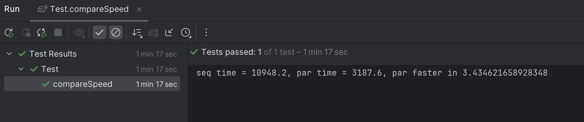

# Практическое задание №1
## Малько Егор Александрович

Код `seq` и `par` расположен в [Main.kt](src\main\kotlin\Main.kt)

Тесты на 
1. корректность (`testSeqCorrectness` и `testParCorrectness`)
2. сравнение время исполнения (`compareSpeed`)

расположены в [Test.kt](src\test\kotlin\Test.kt)

### Код сортировки

Метод `partition`: часть алгоритма quicksort 
- выбирается опорный элемент из отрезка массива
- элементы массива сортируется относительно опорного элемента в один проход на две части
- те что меньше - слева, те что больше - справа
- возвращает правую границу левой части и левую правой 

Метод `seq`
- Вызывает `partition` на отрезке
- последовательно запускаем `seq` от двух частей если их размер хотя бы 2

Метод `par`
- Если размер отрезка меньше 10000 (`PARALLELISM_BORDER`), то запускаем seq
- иначе вызываем `partition` на отрезке
- и параллельно запускаем `par` двух частей если их размер хотя бы 2

`PARALLELISM_BORDER` подобран экспериментально

Параллельный код выполняется на 4 потоках (см `context` в [Main.kt](src\main\kotlin\Main.kt)). 
В этом можно убедиться поменяв количество потоков при инициализации context и запустив тесты. 
Например, я временно поменял количество тредов с 4 на 16, и `par` стал быстрее `seq` в 7 раз, а не в 3

# Тесты

В тестах `testSeqCorrectness` и `testParCorrectness` проверяется корректность алгоритмов. 
- Создается изначальный массив размера 10^6 (элементы от 0 до 10^6)
- В копии массива случайным образом переставляются элементы 
- После чего копия сортируется с помощью `seq` или `par` соответственно
- Проверяется что изначальный массив равен копии (те же элементы на тех же местах)

В тесте `compareSpeed`
- Создается изначальный массив размера 10^8 (элементы от 0 до 10^8)
- Его элементы случайно переставляются
- Сортируем массив замеряя время
- 5 раз повторяем сортируя через `seq` и находим среднее время
- 5 раз повторяем сортируя через `par` и находим среднее время
- проверяем что среднее время `par` быстрее `seq` как минимум в 3 раза

В моем случае получилось быстрее в 3.4 раза

